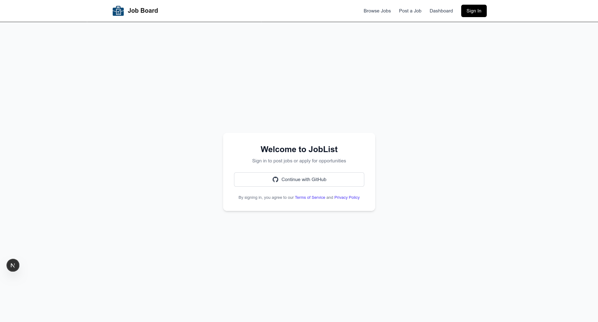

# Job Board

A simple job posting website built with Next.js, where people can log in with their
GitHub account, browse jobs, and post jobs.

This README explains, in plain words, what each part of the project does — and shows
the code for the main files.

## Screenshot



---

## The login system (the main work)

### `auth.ts` — the brain of logging in

It says "let people log in with their GitHub account," and decides what to remember
about them (their id and name). Everything else asks this file when it needs to deal
with logins.

```ts
import NextAuth from "next-auth";
import GitHub from "next-auth/providers/github";
import { PrismaAdapter } from "@auth/prisma-adapter";
import { prisma } from "@/lib/prisma";

export const { auth, handlers, signIn, signOut } = NextAuth({
  session: {
    // Remember who's logged in using a cookie in their browser,
    // so we don't have to check the database every time.
    strategy: "jwt",
  },
  providers: [GitHub],
  adapter: PrismaAdapter(prisma),
  callbacks: {
    // When someone logs in, save their id and name onto their login pass
    // so we can remember who they are on later visits.
    async jwt({ token, user }) {
      if (user) {
        token.id = user.id;
        token.name = user.name;
      }
      return token;
    },

    // Take the id and name we saved and make them available to the rest
    // of the app, so pages know who the logged-in user is.
    async session({ session, token }) {
      if (session.user) {
        session.user.id = token.id as string;
        session.user.name = token.name as string;
      }
      return session;
    },
  },
});
```

### `lib/prisma.ts` — the phone line to your database

Any time the app needs to read or save info (like users), it goes through this file.
It's set up so the app doesn't accidentally open hundreds of database connections
while you're developing.

```ts
import { PrismaClient } from "../app/generated/prisma/client";
import { withAccelerate } from "@prisma/extension-accelerate";

const globalForPrisma = global as unknown as {
  prisma: PrismaClient;
};

const prisma =
  globalForPrisma.prisma || new PrismaClient().$extends(withAccelerate());

if (process.env.NODE_ENV !== "production") globalForPrisma.prisma = prisma;

export { prisma };
```

### `app/api/auth/[...nextauth]/route.ts` — the doorway the browser knocks on

When someone clicks "sign in," gets sent to GitHub, and comes back, all those
behind-the-scenes web requests land here. It just hooks up the ready-made login
machinery from `auth.ts`.

```ts
import { handlers } from "@/auth";

export const { GET, POST } = handlers;
```

### `lib/auth.ts` — the buttons' "log in" and "log out" actions

This file holds two simple actions the buttons use: `login` starts the GitHub sign-in
and sends you to the home page afterwards; `logout` signs you out and sends you back
to the sign-in page. They just wrap the `signIn`/`signOut` that NextAuth made for us
in `auth.ts`.

The `"use server"` line at the top is important: it officially labels these as
**server actions** — work that always runs on the server (logging in/out touches
secrets and the database, so it can't run in the browser). That label is what lets a
button in the browser safely ask the server to run them.

```ts
//this includes all the server action for the user to login and logout
"use server";
import { signIn, signOut } from "@/auth";

export const login = async () => {
  await signIn("github", { redirectTo: "/" });
};

export const logout = async () => {
  await signOut({ redirectTo: "/auth/signin" });
};
```

---

## The pages people see

### `app/auth/signin/page.tsx` — the sign-in screen

The "Welcome to JobList" screen with the "Continue with GitHub" button. The button is
hooked up to the `login` action from `lib/auth.ts`, so clicking it actually starts the
GitHub sign-in.

The `"use client"` line at the top makes this page run **in the browser**. That's
needed because the button uses `onClick`, which is a browser-only feature — clicks
only happen in the browser, so the page that listens for them has to live there too.

```tsx
"use client";
import { login } from "@/lib/auth";

export default function SignInPage() {
  return (
    // ...card and styling...
    <button onClick={login} className="...">
      {/* GitHub icon */}
      Continue with GitHub
    </button>
    // ...
  );
}
```

**How the two pieces work together (the part that took some figuring out):**

- The **button** lives in the browser (`"use client"`) so it can react to a click.
- The **login work** lives on the server (`"use server"` in `lib/auth.ts`) because it
  deals with secrets and the database.
- When you click, the browser button calls the server action, and the server does the
  actual logging in. The two labels (`"use client"` and `"use server"`) are what let
  these two worlds talk to each other safely.

> Without **both** labels you get errors: a server page can't use `onClick`, and the
> browser isn't allowed to run the login code directly. Marking the page as browser
> code **and** the login as a server action is what makes the button work.

### `components/Navbar.tsx` — the top menu bar

Shown on every page: logo, links (Browse Jobs, Post a Job, Dashboard), and a
sign-in/sign-out button.

The Navbar **changes depending on whether you're logged in**:

- It asks NextAuth "who's logged in?" using `useSession()`.
- If someone **is** signed in, it shows a **Sign Out** button (which runs the `logout`
  action from `lib/auth.ts`).
- If **nobody** is signed in, it shows the **Sign In** link instead.

For this to work, the whole app is wrapped in a `SessionProvider` in
`app/layout.tsx` — that's the piece that makes the "who's logged in?" info available
to the Navbar everywhere.

```tsx
"use client";
import { useSession } from "next-auth/react";
import { logout } from "@/lib/auth";

export default function Navbar() {
  // Ask NextAuth who's logged in (empty if nobody is).
  const { data: session } = useSession();

  return (
    // ...logo and links...

    // Signed in? Show Sign Out. Otherwise show Sign In.
    session ? (
      <button onClick={() => logout()} className="...">Sign Out</button>
    ) : (
      <Link href="/auth/signin" className="...">Sign In</Link>
    )
  );
}
```

### `app/jobs`, `app/jobs/post`, `app/dashb` — placeholder pages

The pages for Browse Jobs, Post a Job, and Dashboard. Right now they just show a
title — empty rooms waiting to be furnished. They exist so the menu links don't
hit a "page not found" error.

---

## The database design

### `prisma/schema.prisma` — the blueprint of your database

What info you store and how it's shaped (users, accounts, etc.). Running
`npx prisma generate` turns this blueprint into the code that `lib/prisma.ts` uses.

---

## In one sentence

GitHub login set up end-to-end — the screen people click, the doorway that handles
the login, the brain that decides the rules, and the database connection that
remembers who they are — plus empty pages ready for the actual job-board features.

---

## Setting up login (the secret keys)

The app needs a few private keys to work. These live in env files (`.env` and
`.env.local`), which are **not** committed to GitHub — they stay on your machine.

### 1. The auth secret

Logins are stored in an encrypted cookie. To lock/unlock that cookie, the app needs
a secret key called `AUTH_SECRET`.

Make a random secret and put it in `.env.local`:

```bash
openssl rand -base64 33
```

Then add the result to `.env.local`:

```
AUTH_SECRET=the-random-value-you-just-made
```

> **Heads up — a common gotcha:** some tutorials say to run `npx auth secret`, which
> is supposed to create `.env.local` for you automatically. On some machines that
> command installs the **wrong library (Better Auth)** instead of the one this project
> uses (NextAuth). When that happens it only **prints** a secret named
> `BETTER_AUTH_SECRET` and does **not** create any file. If that happens to you, just
> ignore the name, make your own secret with the `openssl` command above, and save it
> as `AUTH_SECRET` yourself. The end result is identical.

### 2. The GitHub login keys

For the "Continue with GitHub" button to work, you need to register an app with GitHub:

1. Go to GitHub → **Settings → Developer settings → OAuth Apps → New OAuth App**.
2. Fill in the app name and set the callback URL to
   `http://localhost:3000/api/auth/callback/github`.
3. GitHub gives you a **Client ID** and a **Client Secret**.

Add them to `.env.local`:

```
AUTH_GITHUB_ID=your-client-id
AUTH_GITHUB_SECRET=your-client-secret
```

### 3. The database connection

`.env` also needs the address of your database:

```
DATABASE_URL=your-database-connection-string
```

---

## Running the project

```bash
npm install            # install dependencies
npx prisma generate    # build the database code from the blueprint
npm run dev            # start the app at http://localhost:3000
```

Make sure your `.env` and `.env.local` files (above) are filled in first, or login
and the database won't work.
